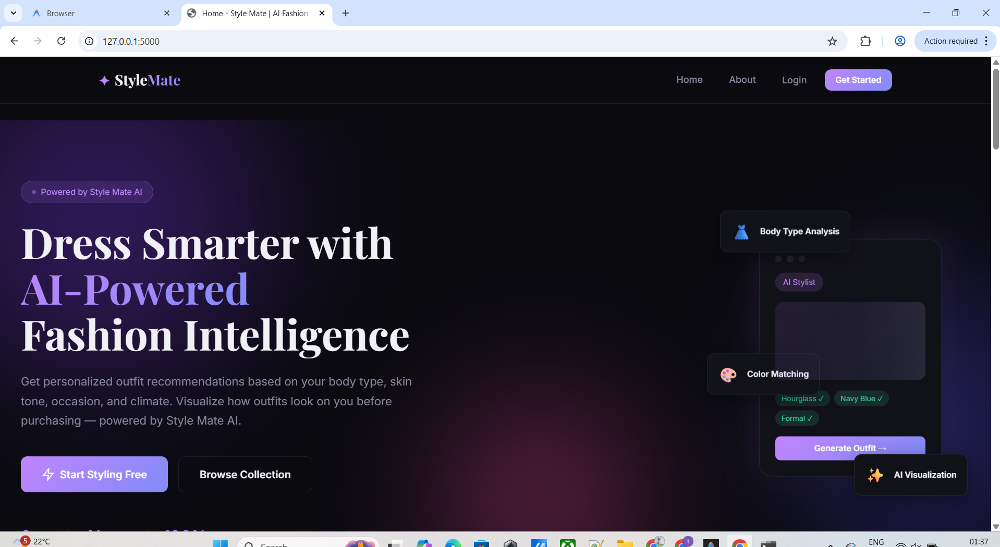
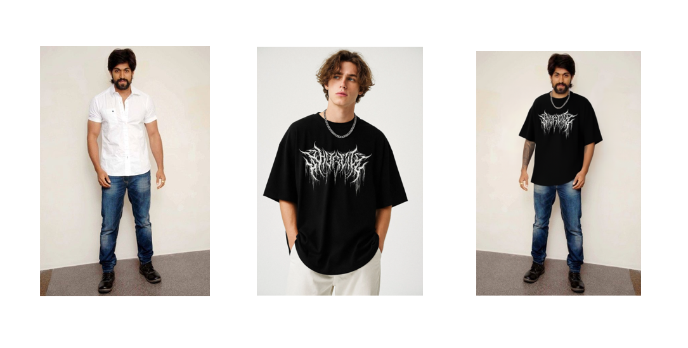
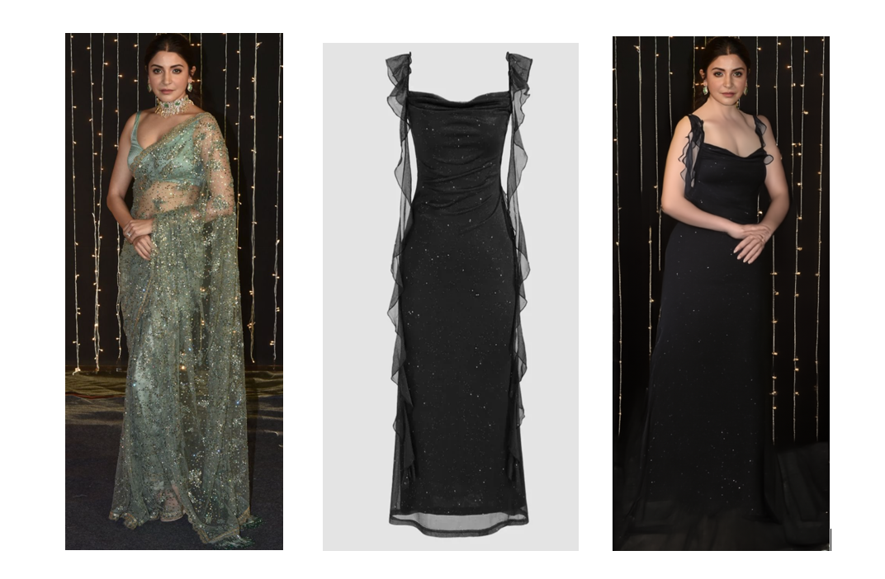

# StyleMate — AI-Powered Fashion Platform

<p align="center">
  
</p>
<p align="center">
  
  
</p>

> **Virtual Try-On · Outfit Recommendations · Multi-Role Marketplace**

StyleMate is a full-stack web application that combines a fashion e-commerce marketplace with **AI Virtual Try-On** powered by the locally-running **FASHN VTON 1.5** model. Users can visualize how garments look on their body before purchasing, receive personalized outfit recommendations from a rule-based styling engine, and shop across multiple vendor brands — all without any cloud AI API costs.

---

## ✨ Key Features

| Feature | Description |
|---|---|
| **AI Virtual Try-On** | Upload your photo + any product image → get a photorealistic try-on preview using FASHN VTON 1.5 |
| **Rule-Based Style Advisor** | Personalized advice based on body type, skin tone, height, and occasion — 100% offline |
| **Outfit Recommendations** | Expert system that recommends styles, colors, and fabrics based on your profile |
| **Multi-Role System** | Separate dashboards for **Users**, **Vendors**, and **Admins** |
| **Download Try-On Images** | Save any generated try-on image directly from your history |
| **Fully Offline** | No API keys required after setup — everything runs locally |

---

## 🖥️ Tech Stack

| Layer | Technology |
|---|---|
| Backend | Python 3.10+, Flask 2.3+ |
| Database | SQLite 3 (file-based, zero config) |
| AI Try-On | [FASHN VTON 1.5](https://github.com/fashn-AI/fashn-vton-1.5) (local, ~2 GB) |
| Style Advisor | Custom rule-based engine (no external API) |
| Frontend | HTML5, Vanilla CSS, Vanilla JavaScript |
| Image Processing | Pillow (PIL) |

---

## 📋 Prerequisites

Make sure the following are installed **before** running the setup:

| Requirement | Version | Download |
|---|---|---|
| **Python** | 3.9 or higher | [python.org](https://python.org) |
| **Git** | Any recent | [git-scm.com](https://git-scm.com) |
| **pip** | Comes with Python | — |
| **GPU (optional)** | CUDA-enabled GPU | Faster inference, not required |

> ⚠️ **Disk Space:** The FASHN VTON 1.5 model weights require approximately **2.3 GB** of free disk space in the project directory. Ensure you have enough space before running setup.

---

## 🚀 Quick Start

### Windows
```batch
# 1. Clone the project
git clone <your-repo-url> StyleMate
cd StyleMate

# 2. Run the one-click setup (installs everything)
setup.bat

# 3. Start the app
python app.py
```

### Linux / macOS
```bash
# 1. Clone the project
git clone <your-repo-url> StyleMate
cd StyleMate

# 2. Make setup script executable and run it
chmod +x setup.sh
./setup.sh

# 3. Start the app
python3 app.py
```

Open your browser at **http://127.0.0.1:5000**

---

## 📁 Project Structure

```
StyleMate/
│
├── app.py                  # Flask application entry point
├── config.py               # App configuration (paths, settings)
├── requirements.txt        # Python dependencies
├── setup.bat               # Windows one-click setup
├── setup.sh                # Linux/macOS one-click setup
├── .env.example            # Environment variable template
├── .gitignore              # Git ignore rules
│
├── models/
│   ├── ai_service.py       # FASHN VTON + rule-based style advisor
│   ├── database.py         # SQLite schema + initialization
│   └── recommendation.py   # Rule-based outfit recommendation engine
│
├── routes/
│   ├── user.py             # User routes (browse, try-on, orders)
│   ├── vendor.py           # Vendor routes (products, orders, sales)
│   └── admin.py            # Admin routes (users, vendors, reports)
│
├── templates/
│   ├── base.html           # Base layout (navbar, footer)
│   ├── index.html          # Landing page
│   ├── user/               # User-facing templates
│   ├── vendor/             # Vendor dashboard templates
│   └── admin/              # Admin panel templates
│
├── static/
│   ├── css/style.css       # Global stylesheet
│   ├── js/main.js          # Frontend scripts
│   ├── uploads/            # User & product images (auto-created)
│   └── generated/          # AI try-on output images (auto-created)
│
├── fashn-vton-1.5/         # FASHN model source (cloned by setup)
└── fashn-weights/          # Model weights ~2 GB (downloaded by setup)
```

---

## ⚙️ Manual Setup (Step by Step)

If you prefer to set up manually instead of using the setup script:

```bash
# Step 1 — Install Flask app dependencies
pip install -r requirements.txt

# Step 2 — Clone FASHN VTON 1.5
git clone https://github.com/fashn-AI/fashn-vton-1.5.git fashn-vton-1.5

# Step 3 — Install FASHN package
pip install -e fashn-vton-1.5

# Step 4 — Download model weights (~2 GB)
python fashn-vton-1.5/scripts/download_weights.py --weights-dir fashn-weights

# Step 5 — Start the application
python app.py
```

---

## 🔧 Configuration

All configuration is in `config.py`. You can override settings via environment variables or a `.env` file:

```bash
# Copy the template
cp .env.example .env
```

| Variable | Default | Description |
|---|---|---|
| `SECRET_KEY` | `stylemate_secret_key_...` | Flask session secret — change in production |
| `FASHN_WEIGHTS_DIR` | `./fashn-weights` | Path to FASHN model weights. Change if your disk is full |

### Storing weights on a different drive (Windows)

If your system drive (C:) doesn't have 2.3 GB free:

```bash
# In .env file:
FASHN_WEIGHTS_DIR=D:\fashn-weights

# Then download weights there:
python fashn-vton-1.5\scripts\download_weights.py --weights-dir D:\fashn-weights
```

---

## 👤 Default Login Credentials

| Role | Email | Password |
|---|---|---|
| **Admin** | admin@stylemate.com | admin123 |
| **Vendor** | vendor@stylemate.com | vendor123 |
| **User** | Register a new account | — |

> ⚠️ Change the admin password in production!

---

## 🧠 How Virtual Try-On Works

1. User uploads a **profile photo** (front-facing, full body)
2. Vendor uploads a **product garment image**
3. On the product page, user clicks **"Generate AI Virtual Preview"**
4. The system:
   - Loads the FASHN VTON 1.5 pipeline (first load ~30s to initialize GPU)
   - Detects garment category (tops / bottoms / one-pieces) from product name
   - Runs inference → fits the garment onto the user's photo
   - Saves the result and displays it with the rule-based styling advice
5. User can **zoom**, **download**, and view all past tries in their **dashboard**

### Inference Speed
| Hardware | First inference | Subsequent |
|---|---|---|
| NVIDIA GPU (CUDA) | ~25–40 sec | ~15–25 sec |
| CPU only | ~3–10 min | ~3–10 min |

---

## 🔍 Troubleshooting

### `ModuleNotFoundError: No module named 'fashn_vton'`
```bash
pip install -e fashn-vton-1.5
```

### Model weights not found
```bash
python fashn-vton-1.5/scripts/download_weights.py --weights-dir fashn-weights
```

### Not enough disk space on C: drive (Windows)
```bash
# Download weights to D: drive and set the env variable
set FASHN_WEIGHTS_DIR=D:\fashn-weights
python fashn-vton-1.5\scripts\download_weights.py --weights-dir D:\fashn-weights
```

### Port 5000 already in use
```bash
python app.py  # edit app.py and change port=5000 to port=5001
```

### Unicode/emoji error during weight download
This is a harmless print encoding bug in the download script — the weights still download correctly. You can verify with:
```bash
python -c "import os; print(os.path.getsize('fashn-weights/model.safetensors') // 1024 // 1024, 'MB')"
# Should print: ~1853 MB
```

---

## 🛡️ Security Notes

- The `SECRET_KEY` in `config.py` is for development only — set a strong random key via `.env` in production
- Passwords are hashed with SHA-256
- All file uploads are validated by extension before saving
- User sessions are scoped by role (`user_role` / `vendor_role` / `admin_role`)

---

## 📄 License

This project is for educational and demonstration purposes.

The **FASHN VTON 1.5** model is subject to its own license — see [fashn-vton-1.5/LICENSE](fashn-vton-1.5/LICENSE).

---

## 🙏 Credits

- **FASHN AI** — for the open-source FASHN VTON 1.5 virtual try-on model
- **Flask** — lightweight Python web framework
- **SQLite** — embedded database engine
- **Pillow** — Python image processing library
